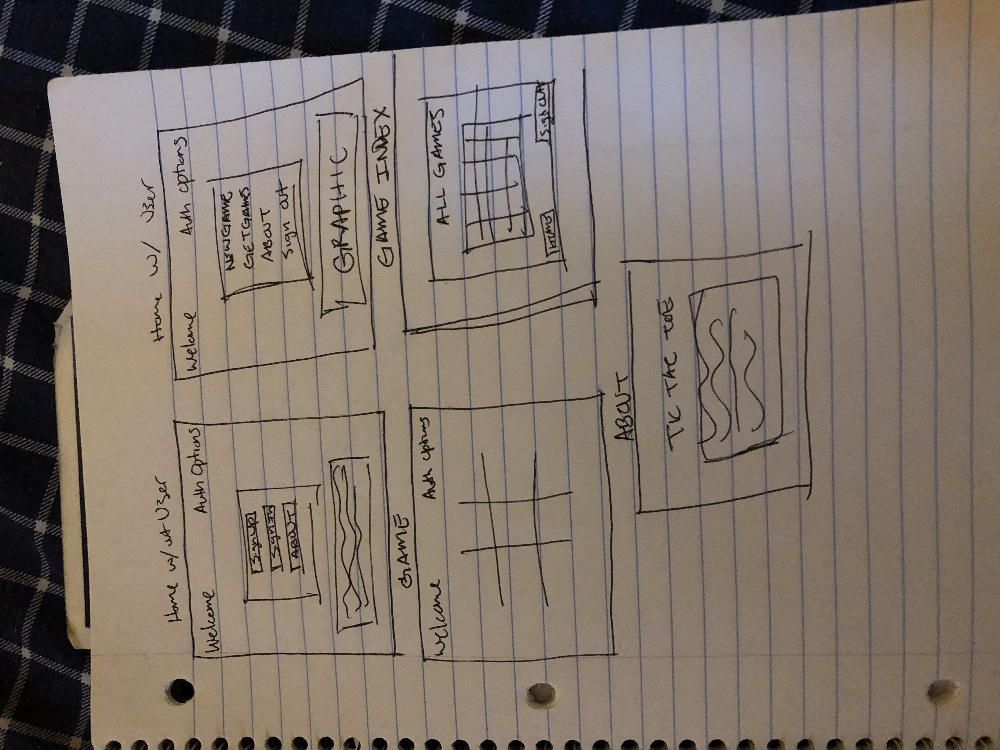

# Tic Tac Toe!!!

## About

Tic-Tac-Toe, also known as noughts and crosses is normally a game you play with
a friend (or by yourself) on a 3x3 grid made on paper with a pencil.  In this
rendition, you can play online with your friend right next to you taking turns!
Although, the opitmal strategy to aim for a tie has probably already been
discovered, it's still a nice way to pass time and keep you sharp!

Create an account, sign-in and remember to have fun!

## Planning

My idea for the design was to have a 3x3 grid with the outter borders hidden
for a cleaner look. One of the end goals for this project was to have the
"X & O" markers replaced by images of X and Zero, from the Megaman series.

Planning consisted of figuring out what was needed for the game, such as a
grid, markers for the grid, turns for the players, win/draw conditions, etc.
The game concepts were first thought out as bullet points, but then turned
to pseudo-code and then became the official logic on my editor.

## Wireframe

## User Stories

The following user stories, helped develop and contributed to the game logic and
features of my site:

1. As a User, I'd like to be able to create an account, if I do not have one
2. As a User, I would want to sign in and be able to create a new game
3. As a User, I'd like to be able to play as if I have someone by my side (or as if I'm going against myself)
4. As a User, I'd like a notification to inform me when when the game is over
5. As a User, I'd like to be able to start a new game after a game is finished
6. As a User, I'd want access to all of my previous games, completed or not
7. As a User, I'd like to be able to finish incompleted games
8. As a User, I would want to be able to sign out with all my information still stored somewhere

## Future Iterations

I would like for future iterations to have soem kind of functionality that is able to keep score of the wins, losses or draws between the players for that sign-in session.

## Technologies Used

* HTML
* CSS
* Sass
* Bootstrap
* JavaScript
* React
* Axios
* General Assembly Tic-Tac-Toe API
